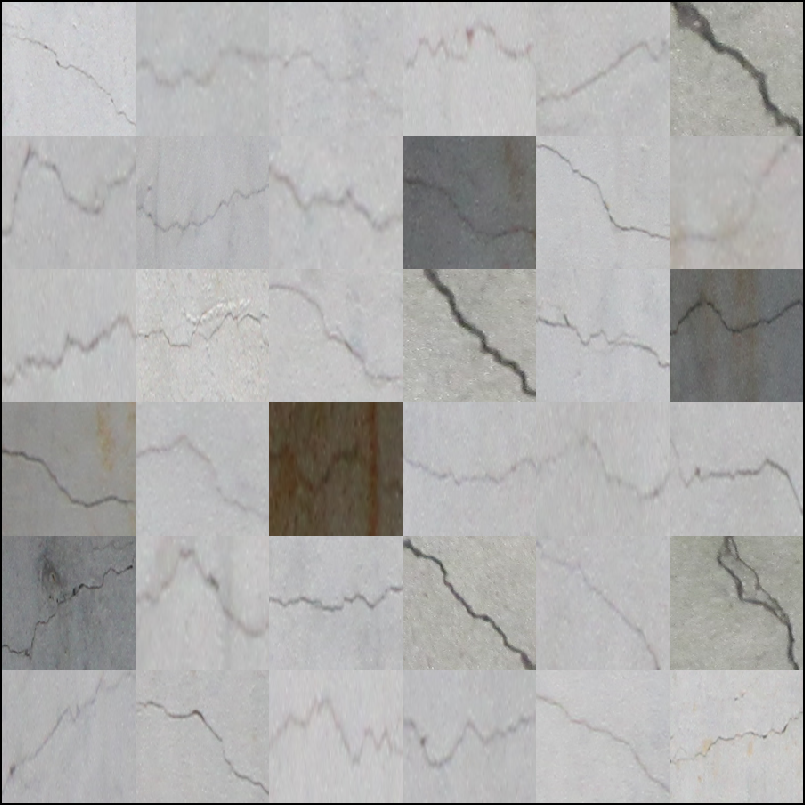
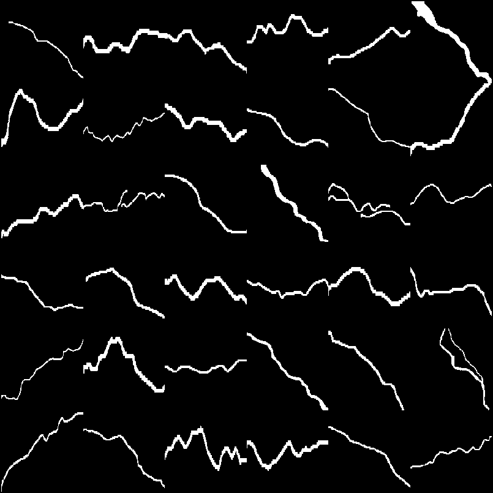
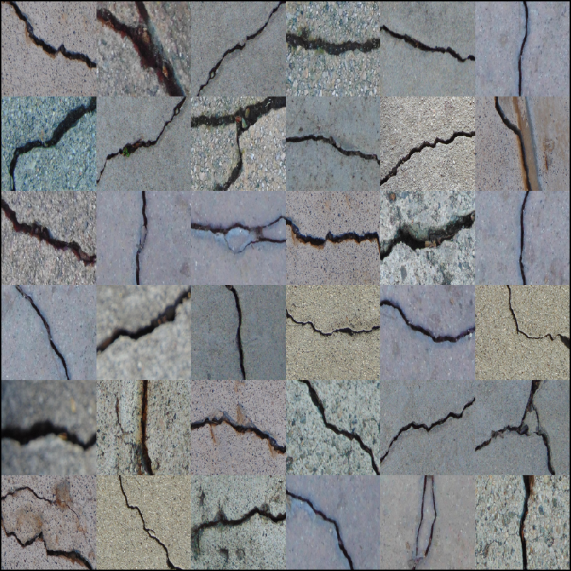
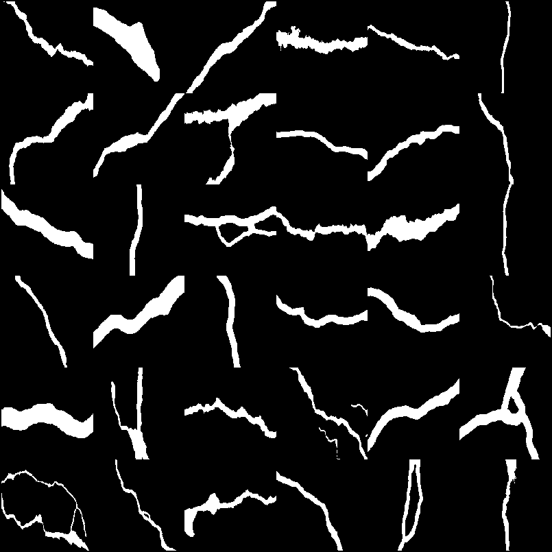
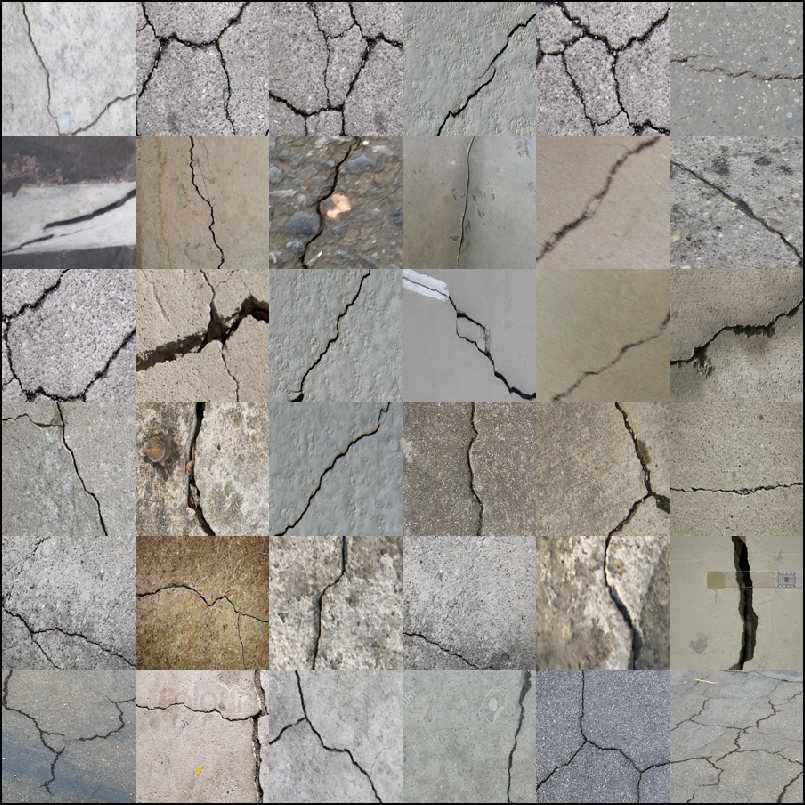
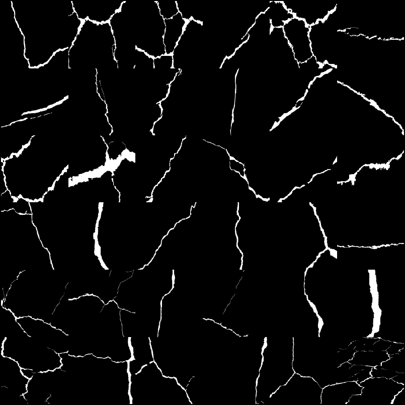
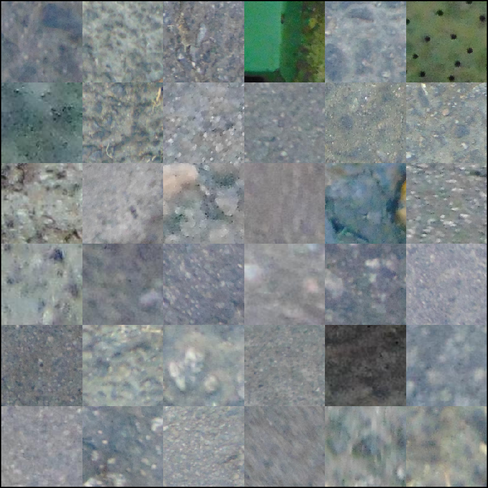

# Synthetic crack generation using dynamic programming and elastic deformation to enhance segmentation of concrete and pavement defects

All source code, synthetic and real-world datasets, and publication materials used in the paper below can be downloaded from this repository.

**Paper:** [Synthetic crack generation using dynamic programming and elastic deformation to enhance segmentation of concrete and pavement defects](https://link.springer.com/article/10.1007/s41062-026-02792-x)  
**Authors:** Preetham Manjunatha, Sami F. Masri, Aiichiro Nakano  
**Journal:** Innovative Infrastructure Solutions ,Volume 11, 408, Springer (2026)   
**DOI:** [10.1007/s41062-026-02792-x](https://doi.org/10.1007/s41062-026-02792-x)

<!-- ABSTRACT-PLACEHOLDER: paste exact abstract text from ScienceDirect here -->
## Abstract

> Accurate crack detection in concrete and pavement images is critical for infrastructure assessment but is limited by the scarcity of large, consistently annotated datasets. Supervised learning methods are particularly sensitive to data scarcity, often overfitting and generalizing poorly across crack types and imaging conditions. This study proposes a synthetic crack generation framework to augment or partially replace real datasets while reducing annotation effort. Synthetic cracks are generated by tracing minimal and maximal cumulative energy paths on random noise fields using dynamic programming, producing realistic one-pixel-wide crack strands. These are expanded via variable-width morphological dilation and deformed through geometric transformations and elastic deformation to model variations in width, tortuosity, and boundary irregularities across longitudinal, transverse, and shear cracks. The synthetic data trains a filter-based segmentation and connected component classification system rather than an end-to-end model. Over 2.25 million unique samples are generated across diverse scales and geometries. Elastic deformation increases geometric diversity, raising the mean normalized pairwise feature distance from approximately 0.17 to 0.31. Evaluation on Cracks-200, CDLN, and DeepCrack datasets shows performance comparable to human-annotated training data, with F1-scores up to 0.79 and mIoU exceeding 0.80. These results demonstrate that synthetic crack data can effectively supplement or substitute real annotated datasets, reducing annotation effort while preserving segmentation performance.

## Repository layout

| Folder | Contents |
|---|---|
| [`MATLAB - Crackmasks/`](MATLAB%20-%20Crackmasks/) | Core synthetic-crack-mask generation engine: dynamic-programming seam tracing, polynomial-curve tracing, elastic/geometric deformation augmentation, and background blending. See [detailed breakdown](#matlab---crackmasks) below. |
| [`MATLAB - Image Segmentor and Analysis/`](MATLAB%20-%20Image%20Segmentor%20and%20Analysis/) | Classical-ML crack-segmentation pipeline (Frangi/Hessian, MFAT, and morphological feature extraction; ANN/KNN/SVM classifiers), dataset construction, ground-truth tooling for public datasets, skeleton/branch-point analysis, and evaluation metrics. See [detailed breakdown](#matlab---image-segmentor-and-analysis) below. |
| [`MAT Files`](https://1drv.ms/f/c/ab3a9bf088335851/IgBRWDOI8Js6IICrALAPAAAAAQE0L1Mc6Rt77MTWElH-v7Y?e=2mHHVr) | Cached feature matrices, trained classifier models (`ZZZ_Mdl*`), train/val/test targets (`ZZZ_XYTargets*`), ground-truth caches, and analysis outputs referenced by the two folders above. See the [MAT file clustering table](#mat-files) below. |
| [`Results/`](Results/) | Output CSVs, figures, paper figures, and text-file logs produced by the pipelines (`ROC_Curves_*`, `AllMetricsTextFile`, `wrtiteOutputs2TextFile`, montage scripts, etc.). |
| [`Python Plots/`](Python%20Plots) | Python scripts used to post-process MATLAB text-file results into the paper's tables and figures (`average_table.py`, `bar_plots_f1_miou.py`, `flowchart.py`, `dp_trace*.py`) plus the methodology flowchart/diagram sources. |

---

## MATLAB - Crackmasks

This folder is the **core synthetic-crack-mask generator**. It builds a random noise "energy" field, traces a thin crack-like seam through it with a dynamic-programming (seam-carving-style) shortest/longest-path search — or alternatively fits a random polynomial curve — dilates the seam to give it width, applies randomized geometric + elastic deformation, rotates/flips it, and writes the augmented masks to disk. A companion Python script independently validates the generated masks against real crack datasets.

### Pipeline

1. **Energy field** — a random noise image is scored with a gradient-magnitude cost map (`funct_energyGrey.m` / `funct_energyRGB.m`), giving the DP search an irregular, non-image-following cost surface.
2. **Crack skeleton generation** (two alternative strategies):
   - **DP path-finding** — one of six seam-carving-style dynamic-programming path finders traces a 1-pixel-wide seam across the energy map.
   - **Polynomial curve fitting** — random scatter points fit to a random-degree polynomial (`polyfit`) define the skeleton instead.
3. **Centering & cleanup** — the seam/curve is isolated (`regionprops`/`bwareaopen`) and recentered (`circshift`).
4. **Dilation** — the 1-pixel seam is thickened into a finite-width crack with a randomly sized disk/rectangle structuring element.
5. **Elastic / geometric deformation** — randomized affine, projective, polynomial, piecewise-linear, or local-weighted-mean warps plus a Gaussian-smoothed random displacement field are applied to produce multiple diverse variants of each crack (`elastic_def_multiplicator.m` → `elastic_deformation.m`).
6. **Rotation, flipping, filtering** — random rotation/flips, followed by morphological cleanup of artifacts introduced by rotation (`filter_stage_I.m`).
7. **Output** — each variant is written as a uniquely named `.bmp` mask, tracked with a `parfor`-safe progress bar (`waitbarParfor.m`).
8. **(Optional) Background blending** — `ImageBlender.m` composites a freshly generated, Gaussian-smoothed crack mask multiplicatively onto real non-crack background photos, producing a synthetic "crack photo" and its paired ground-truth mask.
9. **(Downstream) Validation** — `CrackUniqueness_ElasticDeformation.m` and `edge_metrics.py` statistically confirm that elastic deformation increases sample diversity and that synthetic crack geometry (tortuosity/curvature) matches real cracks; `methodology_Paper.m` renders the paper's illustrative deformation figures.

### Entry-point scripts

| Script | Purpose |
|---|---|
| `CrackGenerator_ElasticDeformation.m` | Primary DP-based generator. Builds noise → energy → picks one of the six DP path finders at random → dilates → elastic-deforms → rotates/flips → writes `.bmp` masks. |
| `CrackGenerator_PolynomialCurve_ElasticDeformation.m` | Alternative generator using a random-degree `polyfit` curve instead of DP search as the crack skeleton; reuses the same deformation/output pipeline. |
| `CrackUniqueness_ElasticDeformation.m` | Bootstraps pairwise Euclidean distances between normalized feature vectors (with/without elastic deformation) to quantify how much elastic deformation increases sample diversity; produces the paper's histogram/KDE/CDF/heatmap uniqueness figures. |
| `methodology_Paper.m` | Demo script that loads one pre-made crack profile and applies a single tuned geometric transform to visualize control points and the resulting warp for the paper's methodology figures. |
| `ImageBlender.m` | Overlays freshly DP-generated seams onto real background images with Gaussian-smoothed multiplicative blending, writing both the blended image and its binary ground truth. |

### Dynamic-programming path-finding functions

Six functions share the interface `[optCrackStrandMask, crackStrandEnergy] = funct_findOptCrackStrand_<Longest|Shortest>Path_<Vertical|Horizontal|Diagonal>(energy [, randomize])`. Each pads the border with `realmax`, runs a forward DP accumulation (min for shortest path, max for longest path) over the 3 causal neighbors, then backtracks from the optimal endpoint:

- `funct_findOptCrackStrand_ShortestPath_Vertical.m` / `funct_findOptCrackStrand_LongestPath_Vertical.m` — top-to-bottom seams.
- `funct_findOptCrackStrand_ShortestPath_Horizontal.m` / `funct_findOptCrackStrand_LongestPath_Horizontal.m` — left-to-right seams.
- `funct_findOptCrackStrand_ShortestPath_Diagonal.m` / `funct_findOptCrackStrand_LongestPath_Diagonal.m` — corner-to-corner seams, with an optional `randomize` flag to pick random start/end rows on the left/right edges.

The random choice among 3 orientations × 2 optimization directions (× randomized endpoints for the diagonal case) is what gives the generator its variety of crack shapes.

### Energy functions

- `funct_energyGrey.m` — gradient-magnitude energy map of a grayscale image (`|dI/dx| + |dI/dy|`); the cost surface the DP finders search over.
- `funct_energyRGB.m` — sums `funct_energyGrey` independently across R/G/B channels.

### Deformation / augmentation functions

- `elastic_deformation.m` — core routine combining a global geometric warp (`affine` / `projective` / `polynomial` / `piecewise_linear` / `local_weighted_mean`, via `fitgeotrans`/`imwarp`) with a local Gaussian-smoothed random displacement field (via `griddata`).
- `elastic_def_multiplicator.m` — `parfor` batch wrapper that calls `elastic_deformation` `totNumberCracksElasticDef` times with randomized transform type/parameters, stacking the results into a 3-D array of deformed variants.
- `filter_stage_I.m` — post-rotation morphological cleanup (`bwmorph` close/bridge/spur/clean) to reconnect broken pixels and remove spurs/orphans.

### Utilities

- `imoverlay.m` — colors mask pixels over an image for visualization (MathWorks utility, S. L. Eddins).
- `randomString.m` — random alphanumeric filename suffix generator.
- `waitbarParfor.m` — `parfor`-safe progress waitbar (`parallel.pool.DataQueue`-based).

### Python validation script

- `edge_metrics.py` — standalone CLI (`opencv`, `numpy`, `scipy`, `skimage`, `pandas`, `matplotlib`, `joblib`, `pyskelgrad`, `tqdm`) that skeletonizes crack masks, extracts left/right boundary edges per strand, computes **tortuosity** and **local curvature** statistics, and statistically compares (KS test, Mann–Whitney U, Wasserstein distance) synthetic vs. real crack geometry, exporting CSVs, plots, and a `summary.txt`. It lives alongside the MATLAB generators because it consumes the `.bmp`/`.png` masks they produce, supporting the paper's geometric-validation results.

---

## MATLAB - Image Segmentor and Analysis

This folder is the **classical-ML crack-segmentation and evaluation pipeline** used to validate the synthetic (and elastic-deformation-augmented real-world) crack images. It extracts vesselness/morphological features from connected components of a binarized crack-candidate map, classifies each component as crack/non-crack with ANN, KNN, and SVM models, and scores the result against several internal and public datasets.

### Vendored third-party toolboxes

- **`functions/` and `shortestpath/`** — D. Kroon's (University of Twente) Accurate Fast Marching / shortest-path toolbox: `msfm2d`/`msfm3d` (multistencil fast marching / eikonal distance maps, with compiled `.mexw64`), `pointmin` (steepest-descent neighbor lookup), and `e1`/`rk4`/`s1` (Euler / 4th-order Runge-Kutta / simple-step path tracers). The top-level `msfm.m` and `shortestpath.m` dispatch into these. Together they implement the fast-marching-based centerline extraction used as the `'fast_marching'`/`'FMM'` thinning option in `skeletonFMM.m`, `crack_deBrancher_BP2EPnBP_LengthConstraint_Feb2019.m`, `Calculate_CrackWidthLength_Paper.m`, and `clusterCracksStrands.m`.
- **`voronoiSkel.m`** — Voronoi-tessellation-based skeletonization (uses the vendored `qhull.exe`), an alternative thinning method for thick blobs.
- **`FrangiFilter2D.m` / `Hessian2D.m` / `eig2image.m`** — D. Kroon / M. Schrijver's 2D Frangi vesselness filter (Hessian eigenvalue ratios).
- **`FractionalIstropicTensor.m` / `ProbabiliticFractionalIstropicTensor.m`** — MFAT (Multiscale Fractional Anisotropy Tensor) vesselness filter (H. F. Alhasson, building on T. Jerman's Hessian-eigenvalue code), an alternative to Frangi.
- **`hausDim.m`** — Hausdorff/box-counting fractal dimension (A. F. Costa).
- **`multiclass_metrics.m`** — general confusion-matrix metrics (originally by Abbas Manthiri S).

### Main pipeline orchestrators

Execution order: build synthetic training features → build real-world training features → augment + combine real-world features with elastic-deformation copies → train ANN/KNN/SVM → run each trained model over the public test sets and score.

| Stage | Parameter script | Driver script |
|---|---|---|
| Synthetic training data | `MainInputs_Training_Synthetic_Dataset.m` | `Main_Training_Synthetic_Dataset_Parfor.m` |
| Real-world training data | `MainInputs_Training_Realworld_Dataset.m` | `Main_Training_Realworld_Dataset_Parfor.m` |
| Real-world + elastic-deformation augmentation | `MainInputs_Training_Realworld_Augment_Dataset.m` | `Main_Training_Realworld_Augment_Dataset_Parfor.m` |
| Testing — Jahanshahi/Cracks-200 | `MainInputs_TestingDataset_Jahan.m` | `Main_TestingDataset_Jahan.m` |
| Testing — CDLN (Cracks-1K) | `MainInputs_TestingDataset_CDLN.m` | `Main_TestingDataset_CDLN.m` |
| Testing — Liu/DeepCrack | `MainInputs_TestingDataset_Liu.m` | `Main_TestingDataset_Liu.m` |

- The synthetic driver builds a feature matrix + labels (`largeFeaturematrixNlabels2025.m`), concatenates it with pre-computed "combo" feature-matrix files, deduplicates (`unique(...,'rows')`), shuffles (`shuffleFeatMatLabel.m`), and splits into train/val/test (`SplitDataLabels.m`) to produce the final `ZZZ_XYTargets*` file consumed by the classifiers.
- The real-world driver extracts features directly from binary ground-truth masks (`largeFeaturematrixNlabelsRealworldData2025.m`, no vesselness filtering needed), combines with the synthetic "combo" set (`combineCrackNoncrackFML.m`), and deduplicates (`uniqueCrackNoncrackFML.m`).
- The augmentation driver clusters real-world cracks by branch-point count (`clusterCracksStrands.m`), applies elastic deformation (`augmentCracks.m`, reusing `elastic_def_multiplicator.m` from `MATLAB - Crackmasks/`), cleans outputs (`deleteEmptyImages.m`, `binarizeImages.m`, `orphanBlobsRemoveImages.m`), re-extracts features, and concatenates real + augmented + synthetic crack rows (`concatenateCracksFM.m`) — this dataset most directly embodies the paper's elastic-deformation-augmentation contribution.
- Each testing harness loads a pre-cached ground truth (built once via `GTMaker_Dataset_*.m` → `GTExtractor_2020_ParFor.m`), builds crack/non-crack file lists, and calls `ProcessFilesStoreResults_Compact.m`, which sweeps `Algorithm_TYPE` (`hybrid_hessian` / `hybrid_MFAT` / `morpho`) × hyperparameter permutations, loads the matching pre-trained ANN/KNN/SVM models, and calls `Processed_Results.m` → `classifierResult_2017Revised.m`/`classifierResult_2020_ParFor.m` → `store_ROC_Values.m` → `calculate_Results2Write.m` → `wrtiteOutputs2TextFile.m`.

> Note: `Main_Training_Synthetic_Dataset_Parfor.m` calls a script `MainInputs_Training_SynPlusReal_Dataset` that is not present in this folder (only `MainInputs_Training_Synthetic_Dataset.m` exists) — likely a stale reference left over from a rename/refactor that should be reconciled before the script can run as-is.

### Feature extraction ("Hessian" / "MFAT" / "Morpho" methods, "5 Jahan features")

The pipeline supports three interchangeable ways of turning a grayscale image into a binary crack-candidate map, each followed by the **same** 5-feature morphological descriptor set:

- **Hessian** — `FrangiFilter2D.m` / `Hessian2D.m` / `eig2image.m` (Frangi vesselness).
- **MFAT** — `FractionalIstropicTensor.m` / `ProbabiliticFractionalIstropicTensor.m` (+ `ProbabiliticMFATSigmas.m` / `ProbabiliticMFATSpacing.m` for hyperparameter sweeps).
- **Morpho** — `funct_crackDetect_Salembier_Sinha_Jahan.m` (multi-directional morphological opening/closing with line structuring elements, Otsu-thresholded).

Each candidate map is Otsu-binarized and blob-size filtered, then passed to `crack_non_crackfeaturesNlabels_2018Revised_5JahanFeatures.m`, which computes the **5 Jahan features** per connected component: (1) eccentricity, (2) ellipse-fill ratio (Area / (π·MajorAxis·MinorAxis)), (3) solidity, (4) row/column coordinate correlation (linearity), and (5) compactness (√(Area/Perimeter)) — plus GT-overlap labeling, branch-point/hole counts, and circularity index.

- `largeFeaturematrixNlabels2025.m` — batch feature-matrix driver for synthetic training images (runs all three filter types).
- `largeFeaturematrixNlabelsRealworldData2025.m` — batch driver for real-world GT masks (already binary, skips filtering).
- `extractFrangiMFAT_Results.m` / `extract_metrics.m` — aggregate precision/recall/F1 arrays across a hyperparameter grid search, split by algorithm type.

### Classifiers

- `ANNClassifier.m` — trains a `patternnet` (single hidden-layer size, `trainscg`, cross-entropy) on the saved `Xtrain/Xval/Xtest` split.
- `ANNClassifier_Hybrid_Iterative.m` — grid search over 1–3 hidden-layer size combinations to tune architecture.
- `KNNClassifier.m` — `fitcknn` (k=5, exhaustive search, Euclidean).
- `SVMClassifier.m` — `fitcsvm` (RBF or polynomial kernel).
- `classifierResult_2017Revised.m` / `classifierResult_2020_ParFor.m` — sequential/parallel per-image test-time inference: re-run the selected filter, classify each blob with all three models, compute pixel- and bbox-level TP/FP/FN/TN.
- `RealCracksClassifierOutput_Paper.m` — lightweight single-image inference wrapper for qualitative paper figures, cleaning non-crack blobs via `fixClass2Labels.m`.

### Ground-truth / public-dataset tooling

- `GTMaker_Dataset_Jahan.m` / `GTMaker_Dataset_CDLN.m` / `GTMaker_Dataset_Liu.m` — one-time GT pre-processing per public dataset, caching bbox + pixel-level ground truth via `GTExtractor_2020_ParFor.m`.
- `Extract_Public_Dataset_Cracks2Classes.m` — splits public GT images into per-crack-strand files using `voronoiSkel`-based skeletonization.
- `liuTrainValDataset.m` — random train/val split of the Liu/DeepCrack GT folder.

### Crack skeleton & geometry analysis

- `crack_deBrancher.m`, `crack_deBrancher_BPLengthConstraint.m`, `crack_deBrancher_BP2EPnBP_LengthConstraint_Feb2019.m` — successive versions of the branch-point "debranching" algorithm that splits a multi-strand crack mask into independent segments (circle-fill, then length-constrained, then full graph traversal via `BPDetection_Mohsin.m`).
- `BPDetection_Mohsin.m`, `Points.m`, `Strand.m` — skeleton-graph traversal data structures.
- `crackWidthLocation.m`, `Calculate_CrackWidthLength_Paper.m`, `bresenham.m` — measure local/overall crack width and length along the skeleton normal; produces the paper's crack geometry statistics.
- `clusterCracksStrands.m` — sorts real-world crack images by branch-point count to select single-strand cracks for augmentation.
- `skeletonFMM.m` — fast-marching-based sub-pixel skeleton extraction.
- `hausDim.m` — fractal dimension of a binary crack mask.

### Evaluation / metrics

- `ROC_Curves_TrainingDataset.m` / `ROC_Curves_TestingDataset.m` — ROC/precision-recall curve plotting (`perfcurve`) for the held-out split and the public test sets respectively.
- `TruePositive_FalsePositive_FalseNegative_Pixel_2018.m` / `TruePositive_FalsePositive_FalseNegative_Bbox_2021b.m` — pixel-level and IoU-matched bbox-level TP/FP/FN/TN.
- `multiclass_metrics.m` / `multiclassPrecision_Recall.m` — confusion-matrix-derived accuracy/precision/recall/F1/specificity/MCC/kappa.
- `store_ROC_Values.m`, `calculate_Results2Write.m`, `AllMetricsTextFile.m`, `wrtiteOutputs2TextFile.m` — accumulate and write out per-run and comparison-table (ANN vs. KNN vs. SVM vs. external CNN baseline) metrics.
- `Processed_Results.m`, `ProcessFilesStoreResults.m` / `_ParFor.m` / `_Compact.m` — orchestrate the per-hyperparameter test loop (`_Compact` is the version currently in use).

### Misc utilities

`addborder.m`, `arclength.m`, `bresenham.m`, `getmidpointcircle.m`, `hysthresh.m`, `filenamesort.m`, `natsort.m`, `normalize.m`, `rmse.m`, `randomString.m`, `imoverlay.m`, `ImageWriter.m`, `imconversion2gray.m`, `PoolWaitbar.m`, `waitbarParfor.m`, `groundNnoisy_BWimage.m`, `blobFilter.m`, `orphanBlobsRemoveImages.m`, `deleteEmptyImages.m`, `binarizeImages.m`, `shuffleFeatMatLabel.m`, `combineCrackNoncrackFML.m`, `concatenateCracksFM.m`, `uniqueCrackNoncrackFML.m`, `fixClass2Labels.m`, `SplitDataLabels.m`, `getFoldersImds.m`, `vislabels.m`, `vis_Labels_CircIndex.m`, `augmentCracks.m`, `SyntheticCrack_nonCrack_Montageplot_Paper.m` — image I/O, sorting, normalization, deduplication, dataset-splitting, and visualization helpers used throughout the pipeline above.

---

## MAT Files

`MAT Files` caches the feature matrices, train/val/test targets, and trained classifiers produced by the two pipelines above so that classification/testing scripts don't need to recompute them. The `ZZZ_Mdl*` / `ZZZ_XYTargets*` files (the ones requested for clustering) follow a consistent naming convention:

```
ZZZ_<ArtifactType>_<Method>_<TestCase>.mat
```

- **`ArtifactType`** — `MdlANN` / `MdlKNN` / `MdlSVM` (a trained classifier) or `XYTargets5JahanFeat` (the corresponding 5-Jahan-feature matrix + train/val/test target split).
- **`Method`** — the feature-extraction method used to produce the crack-candidate map: **Hessian** (Frangi), **MFAT**, or **Morpho** (morphological).
- **`TestCase`** — which dataset/augmentation combination the artifact was built from.

### Test cases

| Test case | Description |
|---|---|
| `Unique` | Full synthetic "combo" dataset (`JahanSynRot5_90_v1_1280×720`), deduplicated — **1,937,558 samples** from 2,338,607 synthetic images. |
| `Unique_100000` | 100,000-sample subsample of `Unique`, used for faster training/iteration. |
| `Realworld` | Features extracted directly from real-world ground-truth crack masks (no augmentation). |
| `Realworld_elasticDefAug` | Features from the elastic-deformation-augmented real-world crack images only. |
| `Realworld+elasticDefAug` | Real-world + elastic-deformation-augmented real-world data combined. |
| `Realworld+elasticDefAug+synthetic` | Real-world + elastic-deformation-augmented real-world + synthetic data combined — the paper's full training set. |

### Model / feature-matrix files, clustered by method × test case

#### Hessian

| Test case | ANN model | KNN model | SVM model | Feature/target matrix |
|---|---|---|---|---|
| Unique | `ZZZ_MdlANN_elastic_hessian_combo_JahanSynRot5_90_v1_1280_720_Unique.mat` | `ZZZ_MdlKNN_elastic_hessian_combo_JahanSynRot5_90_v1_1280_720_Unique.mat` | `ZZZ_MdlSVM_elastic_hessian_combo_JahanSynRot5_90_v1_1280_720_Unique.mat` | `ZZZ_XYTargets5JahanFeat_elastic_hessian_combo_JahanSynRot5_90_v1_1280_720_Unique.mat` |
| Unique_100000 | `ZZZ_MdlANN_elastic_hessian_combo_JahanSynRot5_90_v1_1280_720_Unique_100000.mat` | `ZZZ_MdlKNN_elastic_hessian_combo_JahanSynRot5_90_v1_1280_720_Unique_100000.mat` | `ZZZ_MdlSVM_elastic_hessian_combo_JahanSynRot5_90_v1_1280_720_Unique_100000.mat` | `ZZZ_XYTargets5JahanFeat_elastic_hessian_combo_JahanSynRot5_90_v1_1280_720_Unique_100000.mat` |
| Realworld | `ZZZ_MdlANN_hessian_Realworld.mat` | `ZZZ_MdlKNN_hessian_Realworld.mat` | `ZZZ_MdlSVM_hessian_Realworld.mat` | `ZZZ_XYTargets5JahanFeat_hessian_Realworld.mat` |
| Realworld_elasticDefAug | `ZZZ_MdlANN_hessian_Realworld_elasticDefAug.mat` | `ZZZ_MdlKNN_hessian_Realworld_elasticDefAug.mat` | `ZZZ_MdlSVM_hessian_Realworld_elasticDefAug.mat` | `ZZZ_XYTargets5JahanFeat_hessian_Realworld_elasticDefAug.mat` |
| Realworld+elasticDefAug | `ZZZ_MdlANN_hessian_Realworld+elasticDefAug.mat` | `ZZZ_MdlKNN_hessian_Realworld+elasticDefAug.mat` | `ZZZ_MdlSVM_hessian_Realworld+elasticDefAug.mat` | `ZZZ_XYTargets5JahanFeat_hessian_Realworld+elasticDefAug.mat` |
| Realworld+elasticDefAug+synthetic | `ZZZ_MdlANN_hessian_Realworld+elasticDefAug+synthetic.mat` | `ZZZ_MdlKNN_hessian_Realworld+elasticDefAug+synthetic.mat` | `ZZZ_MdlSVM_hessian_Realworld+elasticDefAug+synthetic.mat` | `ZZZ_XYTargets5JahanFeat_hessian_Realworld+elasticDefAug+synthetic.mat` |

#### MFAT

| Test case | ANN model | KNN model | SVM model | Feature/target matrix |
|---|---|---|---|---|
| Unique | `ZZZ_MdlANN_elastic_mfat_combo_JahanSynRot5_90_v1_1280_720_Unique.mat` | `ZZZ_MdlKNN_elastic_mfat_combo_JahanSynRot5_90_v1_1280_720_Unique.mat` | `ZZZ_MdlSVM_elastic_mfat_combo_JahanSynRot5_90_v1_1280_720_Unique.mat` | `ZZZ_XYTargets5JahanFeat_elastic_mfat_combo_JahanSynRot5_90_v1_1280_720_Unique.mat` |
| Unique_100000 | `ZZZ_MdlANN_elastic_mfat_combo_JahanSynRot5_90_v1_1280_720_Unique_100000.mat` | `ZZZ_MdlKNN_elastic_mfat_combo_JahanSynRot5_90_v1_1280_720_Unique_100000.mat` | `ZZZ_MdlSVM_elastic_mfat_combo_JahanSynRot5_90_v1_1280_720_Unique_100000.mat` | `ZZZ_XYTargets5JahanFeat_elastic_mfat_combo_JahanSynRot5_90_v1_1280_720_Unique_100000.mat` |
| Realworld | `ZZZ_MdlANN_mfat_Realworld.mat` | `ZZZ_MdlKNN_mfat_Realworld.mat` | `ZZZ_MdlSVM_mfat_Realworld.mat` | `ZZZ_XYTargets5JahanFeat_mfat_Realworld.mat` |
| Realworld_elasticDefAug | `ZZZ_MdlANN_mfat_Realworld_elasticDefAug.mat` | `ZZZ_MdlKNN_mfat_Realworld_elasticDefAug.mat` | `ZZZ_MdlSVM_mfat_Realworld_elasticDefAug.mat` | `ZZZ_XYTargets5JahanFeat_mfat_Realworld_elasticDefAug.mat` |
| Realworld+elasticDefAug | `ZZZ_MdlANN_mfat_Realworld+elasticDefAug.mat` | `ZZZ_MdlKNN_mfat_Realworld+elasticDefAug.mat` | `ZZZ_MdlSVM_mfat_Realworld+elasticDefAug.mat` | `ZZZ_XYTargets5JahanFeat_mfat_Realworld+elasticDefAug.mat` |
| Realworld+elasticDefAug+synthetic | `ZZZ_MdlANN_mfat_Realworld+elasticDefAug+synthetic.mat` | `ZZZ_MdlKNN_mfat_Realworld+elasticDefAug+synthetic.mat` | `ZZZ_MdlSVM_mfat_Realworld+elasticDefAug+synthetic.mat` | `ZZZ_XYTargets5JahanFeat_mfat_Realworld+elasticDefAug+synthetic.mat` |

#### Morpho

| Test case | ANN model | KNN model | SVM model | Feature/target matrix |
|---|---|---|---|---|
| Unique | `ZZZ_MdlANN_elastic_morpho_combo_JahanSynRot5_90_v1_1280_720_Unique.mat` | `ZZZ_MdlKNN_elastic_morpho_combo_JahanSynRot5_90_v1_1280_720_Unique.mat` | `ZZZ_MdlSVM_elastic_morpho_combo_JahanSynRot5_90_v1_1280_720_Unique.mat` | `ZZZ_XYTargets5JahanFeat_elastic_morpho_combo_JahanSynRot5_90_v1_1280_720_Unique.mat` |
| Unique_100000 | `ZZZ_MdlANN_elastic_morpho_combo_JahanSynRot5_90_v1_1280_720_Unique_100000.mat` | `ZZZ_MdlKNN_elastic_morpho_combo_JahanSynRot5_90_v1_1280_720_Unique_100000.mat` | `ZZZ_MdlSVM_elastic_morpho_combo_JahanSynRot5_90_v1_1280_720_Unique_100000.mat` | `ZZZ_XYTargets5JahanFeat_elastic_morpho_combo_JahanSynRot5_90_v1_1280_720_Unique_100000.mat` |
| Realworld | `ZZZ_MdlANN_morpho_Realworld.mat` | `ZZZ_MdlKNN_morpho_Realworld.mat` | `ZZZ_MdlSVM_morpho_Realworld.mat` | `ZZZ_XYTargets5JahanFeat_morpho_Realworld.mat` |
| Realworld_elasticDefAug | `ZZZ_MdlANN_morpho_Realworld_elasticDefAug.mat` | `ZZZ_MdlKNN_morpho_Realworld_elasticDefAug.mat` | `ZZZ_MdlSVM_morpho_Realworld_elasticDefAug.mat` | `ZZZ_XYTargets5JahanFeat_morpho_Realworld_elasticDefAug.mat` |
| Realworld+elasticDefAug | `ZZZ_MdlANN_morpho_Realworld+elasticDefAug.mat` | `ZZZ_MdlKNN_morpho_Realworld+elasticDefAug.mat` | `ZZZ_MdlSVM_morpho_Realworld+elasticDefAug.mat` | `ZZZ_XYTargets5JahanFeat_morpho_Realworld+elasticDefAug.mat` |
| Realworld+elasticDefAug+synthetic | `ZZZ_MdlANN_morpho_Realworld+elasticDefAug+synthetic.mat` | `ZZZ_MdlKNN_morpho_Realworld+elasticDefAug+synthetic.mat` | `ZZZ_MdlSVM_morpho_Realworld+elasticDefAug+synthetic.mat` | `ZZZ_XYTargets5JahanFeat_morpho_Realworld+elasticDefAug+synthetic.mat` |

### Standalone analysis files (not part of the method × test-case grid)

| File | Purpose |
|---|---|
| `ZZZ_PairwiseDistance_Paper_2025_final.mat` | Pairwise Euclidean distances between normalized feature vectors, computed by `CrackUniqueness_ElasticDeformation.m` to quantify sample diversity. |
| `ZZZ_PairwiseDistance_Stats_Paper_2025_final.mat` | Summary statistics (bootstrapped) over the pairwise-distance data above. |
| `ZZZ_SyntheticCrackProfileAnalysis_thickcrack_30x15.mat` | A single pre-made thick-crack profile used by `methodology_Paper.m` to illustrate the elastic-deformation methodology figures. |

---

## Datasets

### Real-world datasets

| Dataset | Sample image | Ground truth | Reference | Link |
|---|---|---|---|---|
| Cracks-200 |  |  | [82] | [Download](https://1drv.ms/f/c/49b23bc11eecd6a8/IgAUdotam8oZSp-iZo01XVkOAVVHCqH0_NMzX9dhNLQ1YAs) |
| CDLN |  |  | [26] | [Download](https://1drv.ms/f/c/49b23bc11eecd6a8/UgCo1uwewTuyIIBJv0AAAAAAAPIDZZcjLYzQPuE) |
| DeepCrack |  |  | [24] | [Download](https://1drv.ms/f/c/49b23bc11eecd6a8/IgBhj095LDC3Rr4tofkP1e_JAWcDSCsKBt6owINsmKaAm2s?e=cr8a36) |
| Non-crack images *(used to synthesize background blobs)* |  | — | — | [Download](https://1drv.ms/u/c/49b23bc11eecd6a8/IQAghLWZX3zvR5jRNb5pF3K3AW7H4OkHRNDK7lr3DXwOBc8?e=k311eu) |

### Synthetic and augmented datasets

| Dataset | Description | Link |
| --- | --- | --- |
| Synthetic cracks | DP-traced and polynomial-curve crack masks generated by the `MATLAB - Crackmasks/` pipeline, dilated and elastic-deformed into diverse variants (over 2.25 million samples). | [Download](https://1drv.ms/u/c/49b23bc11eecd6a8/IQCjWDS1Z6OeT7PVybgakNNuAZuHOh-EI3cEHeWX2ZoJLRs?e=mBUtun) |
| Real-world augmented | Real-world crack images from the Real-world datasets above, expanded via elastic/geometric deformation (`elastic_def_multiplicator.m`) to increase geometric diversity for training. | [Download](https://1drv.ms/u/c/49b23bc11eecd6a8/IQAQOiDPf-qQTo8NreR8rCTWAWYrpPxPnryOduAzlltZ_w4?e=hYQYzU) |

---

## Requirements

- **MATLAB** with the Image Processing Toolbox, Statistics and Machine Learning Toolbox, and Parallel Computing Toolbox (most scripts use `parfor`). Some functions (`msfm2d`, `msfm3d`, `rk4`, `skeleton_win.mexw64`, etc.) rely on pre-compiled Windows MEX binaries; equivalent `mexa64`/`mexmaci64` binaries are provided for Linux/macOS.
- **Python 3** (for `MATLAB - Crackmasks/edge_metrics.py`) with `opencv-python`, `numpy`, `scipy`, `scikit-image`, `pandas`, `matplotlib`, `joblib`, `pyskelgrad`, `tqdm`.

## Citation

If you use this code or data, please cite:

> Manjunatha, P. et al. "Synthetic crack generation using dynamic programming and elastic deformation to enhance segmentation of concrete and pavement defects." *Innovative Infrastructure Solutions* (Springer). https://link.springer.com/article/10.1007/s41062-026-02792-x

```bibtex
@article{manjunatha2026synthetic,
  title={Synthetic crack generation using dynamic programming and elastic deformation to enhance segmentation of concrete and pavement defects},
  author={Manjunatha, Preetham and Masri, Sami F and Nakano, Aiichiro},
  journal={Innovative Infrastructure Solutions},
  volume={11},
  number={7},
  pages={408},
  year={2026},
  publisher={Springer}
}
```

## References

Dataset references cited in the table above (numbering follows the paper's bibliography):

[24] Liu Y, Yao J, Lu X, Xie R, Li L (2019) Deepcrack: a deep hierarchical feature learning architecture for crack segmentation. Neurocomputing 338:139–153

[26] Manjunatha P, Masri SF, Nakano A, Wellford LC (2024) Crack-DenseLinkNet: a deep convolutional neural network for semantic segmentation of cracks on concrete surface images. Struct Health Monit 23:796–817

[82] Aghalaya Manjunatha P (2021) Vision-Based and Data-Driven Analytical and Experimental Studies into Condition Assessment and Change Detection of Evolving Civil, Mechanical and Aerospace Infrastructures. Dissertations & theses, University of Southern California, 3550 Trousdale Parkway Los Angeles, CA 90089. Condition assessment, Crack localization, Crack change detection, Synthetic crack generation, Sewer pipe condition assessment, Mechanical systems defect detection and quantification
